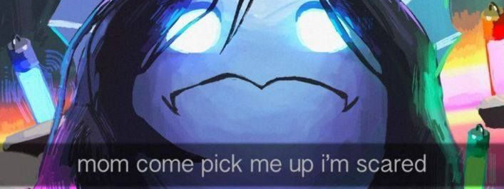
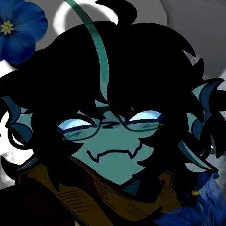

<p align="center">
  
</p>

<table>
<tr>
<td valign="middle">

# Martin Utils

A Discord bot built with [discord.js](https://discord.js.org/), put together as a set of lightweight utility and fun slash commands for a server: 
image processing (wrapping a picture in a frame) and small joke commands like a demoralizing-facts generator.
I'll be add new fun stuff when i find a good idea for this. You also can contribute to this project, see more at [CONTRIBUTING.md](CONTRIBUTING.md).

</td>
<td width="140" align="right" valign="middle">
  
</td>
</tr>
</table>

---

### Project structure

```
martin-utils/
├── package.json
└── src/
    ├── bot.js                  # entry point: loads commands/events, registers slash commands, logs in
    ├── deploy-commands.js      # standalone script to (re)register slash commands
    ├── commands/
    │   ├── image/
    │   │   └── framethis.js     # /framethis
    │   └── misc/
    │       └── demoralize.js    # /demoralize
    ├── events/
    │   ├── ready.js             # logs a message once the bot is logged in
    │   └── interactionCreate.js # handles slash command invocations
    └── media/
        └── frame.png            # golden frame used by /framethis
```

### Commands

| Command | Category | Description |
|---|---|---|
| `/framethis image:<file>` | image | Wraps the supplied image in a golden frame (`media/frame.png`), automatically detecting the frame's transparent area |
| `/demoralize` | misc | Sends a random demoralizing fact from a predefined list |

